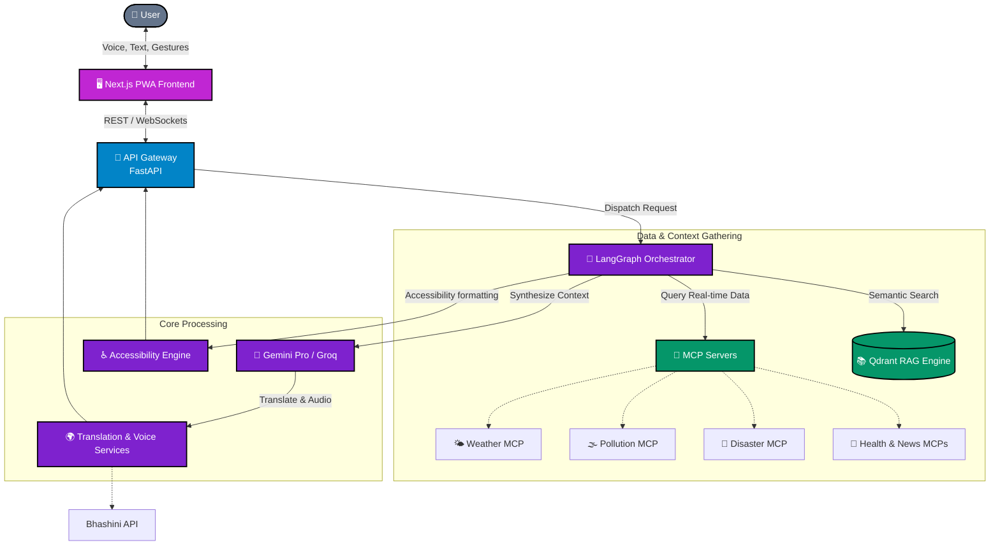
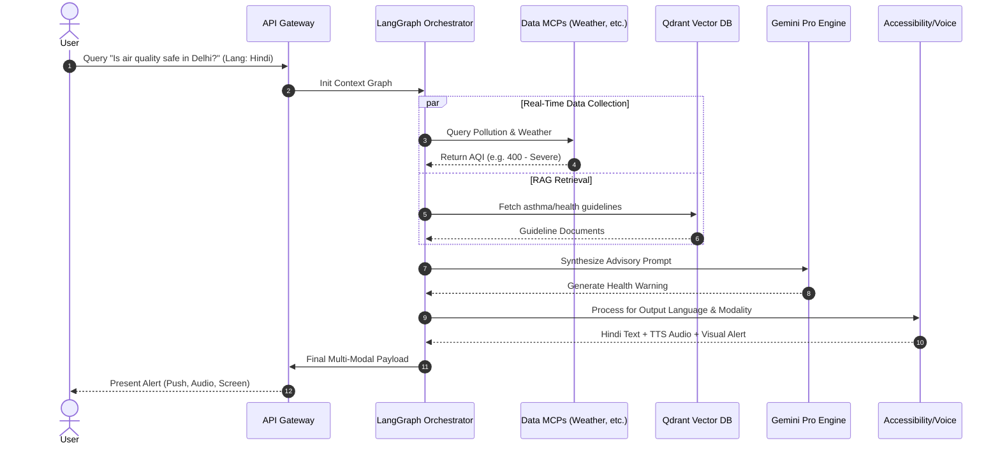

<div align="center">
  
  
  
  
  
  
  <br />
  <br />
  
  <h1>🏝️ Oasis</h1>
  
  <p>
    <b>Intelligent Health & Safety Advisory Platform for India</b>
  </p>
  
  <p>
    <i>AI-powered, real-time health and safety recommendations based on climate, disasters, weather, pollution, conflicts, and crises across India — accessible to <b>all</b> (including deaf and blind communities) in <b>13+ Indian languages</b> with full voice interaction.</i>
  </p>

  <p>
    
    
    
  </p>
</div>

---

<details>
<summary><h2>✨ Why Oasis? (Click to Expand)</h2></summary>
<br>

Oasis bridges the gap between critical public health data and the diverse population of India. By leveraging advanced Language Models, Agentic Workflows, and Multi-Modal accessibility, it transforms raw metrics into actionable, life-saving advice for everyone—regardless of language barriers or physical abilities.

- 🧠 **Agentic RAG Pipeline**: LangGraph-powered self-correcting workflow with Gemini Pro.
- 🌤️ **Real-Time Data**: Integrates Weather (IMD), Pollution (CPCB), and Disasters (NDMA).
- 🌍 **13+ Indian Languages**: Seamless translation via the Bhashini API.
- 🔊 **Voice-First Accessibility**: Full ASR and TTS interaction for blind/visually impaired users.
- 🤟 **Deaf Accessibility**: Visual alerts, iconography, vibration patterns, and ISL support.
- 📍 **Location-Aware**: Personalized advisories tailored to the user's precise geography.

</details>

<details open>
<summary><h2>🏗️ System Architecture</h2></summary>
<br>

Oasis is designed as a cloud-native, microservices-driven platform. It uses a LangGraph orchestrator to coordinate various independent MCP (Model Context Protocol) servers that fetch real-time public data.


</details>

<details open>
<summary><h2>🔄 Dynamic Workflows</h2></summary>
<br>

The request lifecycle is managed by an intelligent graph that ensures real-time accuracy and multi-modal delivery.


</details>

<details>
<summary><h2>🛠️ Tech Stack & Ecosystem</h2></summary>
<br>

| Domain | Technologies |
| :--- | :--- |
| **Frontend** | React, Next.js 14+ (PWA) |
| **Backend** | Python 3.12, FastAPI, LangChain, LangGraph |
| **AI / LLMs** | Google Gemini Pro, Groq, Sentence Transformers |
| **Data Integration** | MCP (Model Context Protocol) Servers |
| **Databases** | PostgreSQL, Redis, Qdrant (Vector DB) |
| **Translation & Speech** | Bhashini API (IndicTrans2) |
| **Observability** | OpenTelemetry, Grafana, Prometheus, Loki, Tempo |

</details>

<details>
<summary><h2>📁 Project Structure</h2></summary>
<br>

```text
Oasis/
├── 🖥️ frontend/                # Next.js PWA frontend
├── ⚙️ services/                # Microservices architecture
│   ├── gateway/               # Central API Gateway
│   ├── orchestrator/          # LangGraph coordination
│   ├── ml-pipeline/           # Machine learning models
│   ├── accessibility-engine/  # ARIA & sensory adaptations
│   ├── voice/                 # ASR/TTS processors
│   ├── translation/           # Bhashini wrappers
│   ├── rag-engine/            # Qdrant querying
│   ├── data-ingestion/        # Batch data processing
│   ├── auth/                  # Authentication service
│   └── notification/          # Multi-channel alerts
├── 🔌 mcp-servers/             # Model Context Protocol servers
│   ├── weather-mcp/
│   ├── pollution-mcp/
│   ├── disaster-mcp/
│   ├── health-mcp/
│   ├── news-mcp/
│   └── geo-mcp/
├── 📊 observability/           # Grafana & Prometheus dashboards
└── 📚 knowledge-base/          # Source documents for RAG
```
</details>
